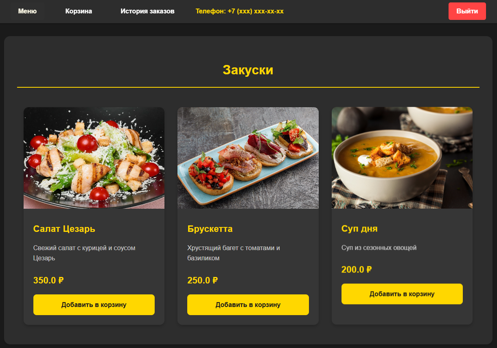
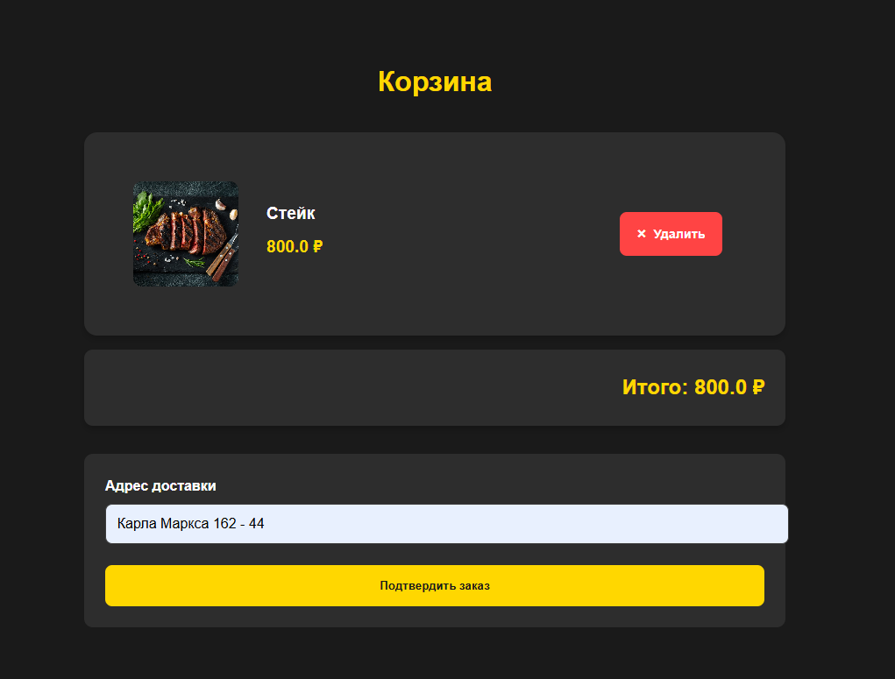

# Restaurant Website (Ресторанный веб-сайт на Flask)

# **Обзор проекта**

Это веб-приложение на Flask представляет собой ресторанный веб-сайт, который предоставляет пользователям следующие возможности:

**Просмотр меню:**

Пользователи могут просматривать меню ресторана, которое организовано по категориям блюд.

**Добавление блюд в корзину:**

Пользователи могут добавлять выбранные блюда в корзину для последующего заказа.

**Оформление заказов:**

После добавления блюд в корзину пользователи могут оформить заказ, указав адрес доставки.

**Просмотр истории заказов:**

Зарегистрированные пользователи могут просматривать историю своих заказов и детальную информацию по каждому заказу.

**Аутентификация:**

Приложение поддерживает регистрацию и вход пользователей для персонализации опыта.

**Установка и запуск**

**Требования**

Python 3.x

Flask

Flask-WTF

Flask-Login

Flask-SQLAlchemy

Другие зависимости, указанные в requirements.txt

**Инструкции по установке**

Клонируйте репозиторий с помощью Git:

git clone https://github.com/Kaishivee/menu_app_urban.git

**Перейдите в каталог проекта:**

cd restaurant-website

**Создайте и активируйте виртуальное окружение:**

python -m venv venv
# Для Windows
venv\Scripts\activate
# Для Unix/MacOS
source venv/bin/activate

**Установите зависимости:**

pip install -r requirements.txt

**Настройте конфигурацию приложения:**

Скопируйте config.py.example в config.py и обновите настройки при необходимости (например, SECRET_KEY и параметры базы данных).

Инициализируйте базу данных: В файле app.py реализована функция init_db(), которая заполняет базу данных начальными данными.

python app.py init_db

# Запустите приложение:

**python app.py**

Откройте браузер и перейдите по адресу http://localhost:5000 для доступа к приложению.

# Структура проекта
Проект включает следующие ключевые компоненты:

**app.py:** 

Основной файл приложения.

Содержит маршруты приложения.
Логику аутентификации.

Управление корзиной и заказами.

Функцию init_db() для инициализации базы данных.

**models.py:**

Определения моделей базы данных с использованием SQLAlchemy:

User: Модель пользователя с полями id, username, password_hash.

Category: Категория блюд с полями id, name.

Dish: Блюдо с полями id, name, price, category_id, description.

Order: Заказ с полями id, user_id, address, status.

OrderItem: Позиция в заказе с полями id, order_id, dish_id, quantity.

**forms.py:**

Определения форм с использованием Flask-WTF:

Форма регистрации.

Форма входа.

Форма оформления заказа.

**config.py:**

Конфигурационный файл для настройки приложения:

SECRET_KEY: Секретный ключ для сессий.

SQLALCHEMY_DATABASE_URI: URI для подключения к базе данных.

**Другие настройки.**

templates/: Папка с HTML-шаблонами:

base.html: Базовый шаблон с навигационной панелью и блоком сообщений.

login.html: Шаблон страницы входа.

register.html: Шаблон страницы регистрации.

menu.html: Шаблон страницы меню ресторана.

cart.html: Шаблон страницы корзины.

order_status.html: Шаблон страницы статуса заказа.

order_history.html: Шаблон страницы истории заказов.

static/: Папка со статическими файлами:

css/: Стили CSS.

images/: Изображения блюд и другие медиафайлы.

# Решение проблем

**Приложение не запускается:**

Убедитесь, что вы активировали виртуальное окружение.

Проверьте, что все зависимости установлены корректно.

Проверьте конфигурацию в config.py.

**Ошибки базы данных:**

Убедитесь, что база данных инициализирована с помощью init_db().

Проверьте строку подключения в SQLALCHEMY_DATABASE_URI.

**Проблемы с аутентификацией:**

Убедитесь, что формы регистрации и входа работают без ошибок.

Проверьте обработчики маршрутов для /login и /register.

**Статические файлы не отображаются:**

Проверьте ссылки на статические файлы в шаблонах.

Убедитесь, что файлы находятся в правильных каталогах внутри static/.
Поддержка